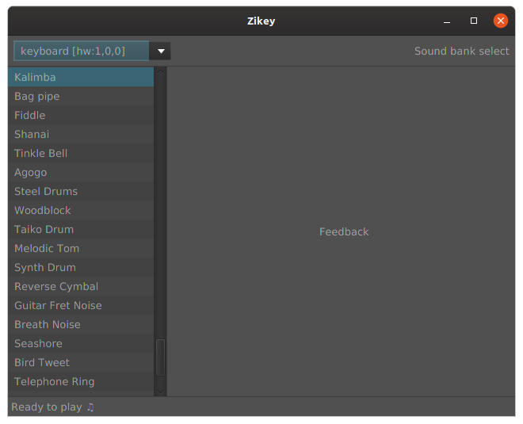

# Zikey

A no bullshit mu**zik key**board player.



So you just got a sweet little USB midi keyboard, but don't know what to install to play it? Or you've seen all those
complicated tutorial installing & connecting several tools together? But all you want, is just type your keyboard, and
some sound to come out...

**Zikey** might be what you're looking for:
 * run it
 * type on your **keyboard**
 * sound comes out of a **synthesizer**
 
 That's it.

_Please note that this software is a **work in progress**. It currently doesn't have a user-interface and doesn't allow
changing the instrument._

## Installing

* download the [latest release](https://github.com/mrlem/zikey/releases/tag/v0.3)
* extract it

## Running

### On Linux

* run:
```
bin/zikey
```

### On Windows

* run:
 ```
bin/zikey.bat
```

## About

### Author

* *Sébastien Guillemin*

### License

GPLv3 see [LICENSE.md](LICENSE.md)

### Acknowlegments

Built with:

* [Java Sound](https://openjdk.java.net/groups/sound/): Java Sound API
* [JavaFX](https://openjfx.io): Java graphics & UI API
